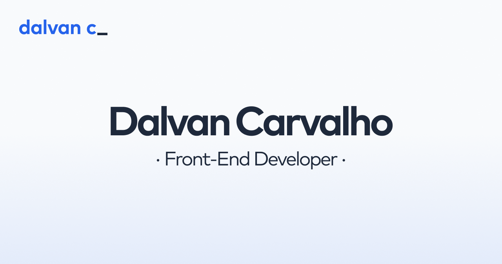
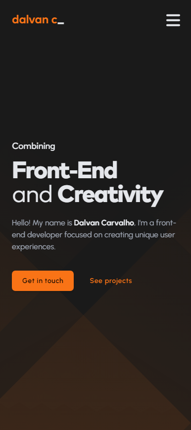

<h1 align="center">Página pessoal de Dalvan Carvalho</h1>

<div align="center">
  
  &nbsp;
  
  &nbsp;
  
</div>

<br>

<p align="center">
  Bem-vindo ao repositório da minha página pessoal, construída com
  <a href="https://vitejs.dev/">Vite</a> e
  <a href="https://react.dev/">React</a>, e implementada com
  <a href="https://vercel.com/">Vercel</a>!
  <br>
  A página está disponível em <strong>Português (Brasil)</strong> e <strong>Inglês (Estados Unidos)</strong>.

</p>

<br>

<div align="center">
  
</div>

<br>

## Índice

- [Algumas notas rápidas](#algumas-notas-rápidas)
- [Sobre](#sobre)
- [Aparência](#aparência)
  - [Desktop](#-desktop)
  - [Dispositivos móveis](#-dispositivos-móveis)
- [Recursos](#recursos)
- [Instalação](#instalação)
- [Criando a build e rodando em produção](#fazendo-a-build-e-rodando-em-produção)
- [Referências de estilo](#referências-de-estilo)
  - [Fontes](#-fontes)
  - [Cores](#-cores)
  - [Ícones](#-ícones)
- [Licença](#licença)

## Algumas notas rápidas

- Você é livre para dar _fork_ neste repositório se desejar, mas por favor não esqueça de me dar os devidos créditos se o seu plano for usá-lo para outra finalidade que não seja estudo. Se possível, crie um link apontando para esta URL: [https://dalvanc.com/](https://dalvanc.com/).

- A página está em constante evolução, então fique ligado para atualizações futuras!

## Sobre

Este projeto foi criado para servir como minha página pessoal/portfólio e documentar minha jornada no mundo do desenvolvimento Front-End. Foi a minha primeira vez utilizando **React**, proporcionando uma ótima oportunidade para aprender sobre as vantagens que ele oferece frente ao JavaScript tradicional. Todos os recursos utilizados em seu desenvolvimento estão listados na seção [Recursos](#recursos).

## Aparência

A página conta com uma versão clara e uma escura. Você pode pré-visualizar ambas nas capturas de tela abaixo:

### ⬩ Desktop

**Versão clara:**

<div align="center">
  
</div>

**Versão escura:**

<div align="center">
  
</div>

### ⬩ Dispositivos móveis

**Versão clara:**

<div align="center">
  
</div>

<br>

**Versão escura:**

<div align="center">
  
</div>

## Recursos

Na tabela abaixo, encontram-se todos os recursos utilizados no desenvolvimento da página:

| Recurso                                                                       | Utilização                                             |
| ----------------------------------------------------------------------------- | ------------------------------------------------------ |
| [EmailJS](https://www.emailjs.com/)                                           | Envio de e-mails, diretamente do formulário de contato |
| [Font Awesome](https://fontawesome.com/)                                      | Ícones e logomarcas                                    |
| [GSAP](https://greensock.com/gsap/)                                           | Animações ao longo da página                           |
| [i18next](https://react.i18next.com/)                                         | Internacionalização da página                          |
| [Prism](https://prismjs.com/)                                                 | Realce de sintaxe em blocos de código                  |
| [React Helmet Async](https://www.npmjs.com/package/react-helmet-async/)       | Manipulação de metadados                               |
| [React Router](https://reactrouter.com/en/main/)                              | Gerenciamento de rotas                                 |
| [React Scroll](https://www.npmjs.com/package/react-scroll/)                   | Gerenciamento de links internos ao longo da página     |
| [React Scroll Parallax](https://www.npmjs.com/package/react-scroll-parallax/) | Efeito paralaxe na seção principal e projetos          |

## Instalação

> 📌 **Antes de começar:** Certifique-se de que você tenha o **Node.js** e o **Git** instalados em seu sistema. Você precisará deles para instalar as dependências do projeto e realizar todas as tarefas relacionadas ao Git, como dar um _commit_ e _push_ em suas alterações para o seu próprio repositório no [GitHub](https://github.com/).
>
> [**Baixe o Node.js**](https://nodejs.org/pt-br/download) - _Escolha a versão **LTS** se você não tem certeza ou nunca instalou o **Node.js** antes_ <br> [**Baixe o Git**](https://git-scm.com/downloads)

1. Após dar _fork_ neste repositório, navegue até sua pasta e abra o terminal. Para facilitar as coisas, você também pode abrir o terminal diretamente do seu editor de código (eu recomendo o [Visual Studio Code](https://code.visualstudio.com/)).

2. Instale todas as dependências do projeto:

   ```
   npm install
   ```

3. Execute o servidor de desenvolvimento:

   ```
   npx vite
   ```

## Compilando e rodando em produção

1. Gere uma compilação de produção:

   ```
   npx vite build
   ```

2. Pré-visualize a compilação de produção (como aparecerá quando for implementada):

   ```
   npx vite preview
   ```

## Referências de estilo

### ⬩ Fontes

| Elemento de texto |                     Família da fonte                     |     Tipo     |
| ----------------- | :------------------------------------------------------: | :----------: |
| Título            |         [Mark Pro](https://8font.com/mark-pro/)          |  sans-serif  |
| Parágrafo         |  [Urbanist](https://fonts.google.com/specimen/Urbanist)  |  sans-serif  |
| Bloco de código   | [Fira Code](https://fonts.google.com/specimen/Fira+Code) | monoespaçada |
| Especial          | [Rock Salt](https://fonts.google.com/specimen/Rock+Salt) |   cursiva    |

### ⬩ Cores

| Papel                     | Nome no Tailwind |                         Código hexadecimal                         |
| ------------------------- | :--------------: | :----------------------------------------------------------------: |
| Principal                 |     blue-600     |  `#2563eb` |
| Principal (versão escura) |    orange-500    |  `#f97316` |
| Fundo                     |  _custom color_  |  `#f8fafc` |
| Fundo (versão escura)     |  _custom color_  |  `#1a1a1a` |
| Texto                     |    slate-600     |  `#475569` |
| Texto (versão escura)     |     gray-400     |  `#9ca3af` |

### ⬩ Ícones

Todos os ícones utilizados são do [Font Awesome](https://fontawesome.com/).

## Licença

Este projeto está licenciado sob a **licença MIT**. Você pode ler os termos completos da licença clicando [aqui](./LICENSE).

&copy; 2023 **Dalvan Carvalho**
