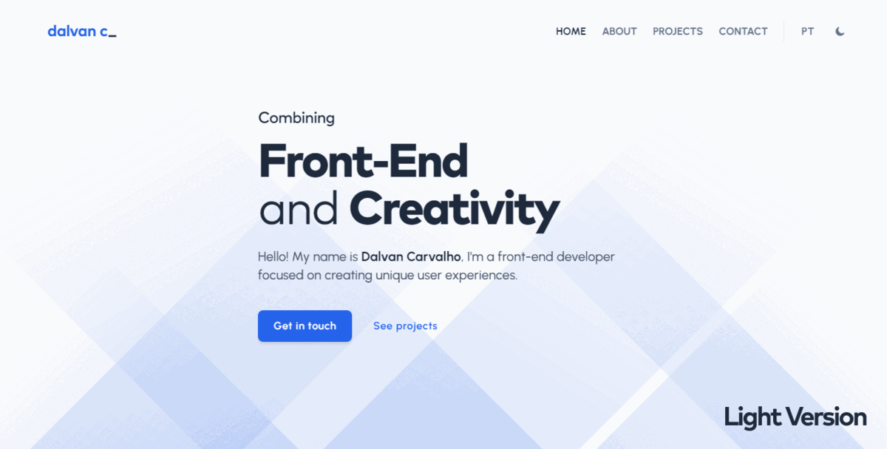
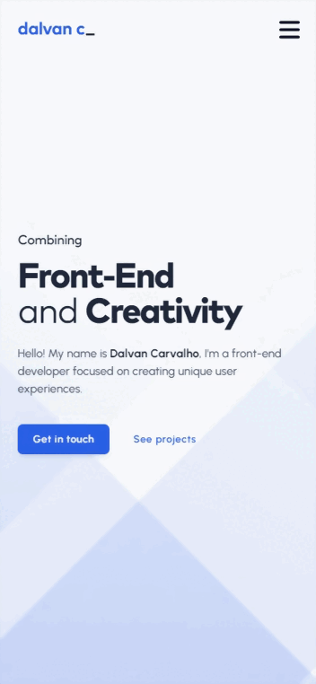

# Website pessoal de Dalvan Carvalho


Bem-vindo ao repositório do meu website pessoal, construído com [Vite](https://vitejs.dev/) e [React](https://react.dev/), e implementado com [Vercel](https://vercel.com/)! O website está disponível em **português** e **inglês** e você pode acessá-lo clicando no link abaixo:

🌎 [**dalvanc.com**](https://dalvanc.com/)

<br />

<div align="center">
  
</div>

<br />

## Índice

- [Algumas notas rápidas](#algumas-notas-rápidas)
- [Sobre](#sobre)
- [Aparência](#aparência)
  - [Desktop](#desktop)
  - [Dispositivos móveis](#dispositivos-móveis)
- [Recursos](#recursos)
- [Instalação](#instalação)
- [Gerando a build e rodando em produção](#gerando-a-build-e-rodando-em-produção)
- [Referências de estilo](#referências-de-estilo)
  - [Fontes](#fontes)
  - [Cores](#cores)
  - [Ícones](#ícones)
- [Licença](#licença)

## Algumas notas rápidas

- Você é livre para dar _fork_ neste repositório se desejar, mas por favor não esqueça de me dar os devidos créditos se o seu plano for usá-lo para outra finalidade que não seja estudo. Se possível, crie um link apontando para esta URL: [https://dalvanc.com/](https://dalvanc.com/).

- O website está em constante evolução, então fique ligado para atualizações futuras!

## Sobre

Este projeto foi criado para servir como meu website pessoal/portfólio e documentar minha jornada no mundo do desenvolvimento front-end. Foi a minha primeira vez utilizando **React**, proporcionando uma ótima oportunidade para aprender sobre as vantagens que ele oferece frente ao JavaScript tradicional. Todos os recursos utilizados em seu desenvolvimento estão listados na seção [Recursos](#recursos).

## Aparência

O website conta com uma versão clara e uma escura. Você pode pré-visualizar ambas nos gifs abaixo:

### Desktop

<div align="center">
  
</div>

### Dispositivos móveis

<div align="center">
  
</div>

## Recursos

A tabela abaixo lista todos os recursos utilizados pelo website:

| Recurso                                                                       |                            Utilização                             |
| ----------------------------------------------------------------------------- | :---------------------------------------------------------------: |
| [EmailJS](https://www.emailjs.com/)                                           |         Envia emails diretamente do formulário de contato         |
| [Embla Carousel](https://www.embla-carousel.com/)                             |          Exibe items dentro de um componente 'carrossel'          |
| [Font Awesome](https://fontawesome.com/)                                      |                        Ícones e logomarcas                        |
| [Fontsource](https://fontsource.org/)                                         |                Hospeda fontes do Google localmente                |
| [GSAP](https://greensock.com/gsap/)                                           |           Exibe diversas animações ao longo do website            |
| [i18next](https://react.i18next.com/)                                         | Permite aos usuários alternar entre os idiomas português e inglês |
| [Prism](https://prismjs.com/)                                                 |              Realce de sintaxe para blocos de código              |
| [Radix](https://www.radix-ui.com/)                                            |       Exibe/oculta items dentro de um componente 'acordeão'       |
| [React Confetti](https://www.npmjs.com/package/react-confetti)                |     Exibe uma animação de confetes após o envio do formulário     |
| [React Helmet Async](https://www.npmjs.com/package/react-helmet-async/)       |                    Gerenciamento de metadados                     |
| [React Router](https://reactrouter.com/en/main/)                              |                      Gerenciamento de rotas                       |
| [React Scroll](https://www.npmjs.com/package/react-scroll/)                   |                   Animação de rolagem vertical                    |
| [React Scroll Parallax](https://www.npmjs.com/package/react-scroll-parallax/) |     Efeito paralaxe na seção principal e nos cards de projeto     |
| [Sonner](https://sonner.emilkowal.ski/)                                       |      Exibe mensagens curtas dentro de um componente 'toast'       |

<br />

[Vite](https://vitejs.dev/), [React](https://react.dev/) e [Tailwind CSS](https://tailwindcss.com/) também foram utilizados durante o desenvolvimento.

## Instalação

> 📌 **Antes de começar:** Certifique-se de que você tenha o **Node.js** e o **Git** instalados em seu sistema. Você precisará deles para instalar as dependências do projeto e realizar todas as tarefas relacionadas ao Git, como dar um _commit_ e _push_ em suas alterações para o seu próprio repositório no **GitHub**.
>
> [**Baixe o Node.js**](https://nodejs.org/pt-br/download) - _Escolha a versão **LTS** se você não tem certeza ou nunca instalou o **Node.js** antes_ <br> [**Baixe o Git**](https://git-scm.com/downloads)

1. Navegue até a pasta do projeto abra o terminal. Para facilitar as coisas, você também pode abrir o terminal diretamente do seu editor de código (recomendo o [Visual Studio Code](https://code.visualstudio.com/)).

2. Instale o Yarn, caso ainda não tenha instalado no seu sistema (opcional):

   > 💡 **Yarn** é uma alternativa ao **Node Package Manager (NPM)**

   ```
   npm install --global yarn
   ```

3. Instale todas as dependências do projeto:

   ```
   yarn
   ```

   _ou se você preferir NPM:_

   ```
   npm install
   ```

4. Execute o servidor de desenvolvimento:

   ```
   npx vite
   ```

## Gerando a build e rodando em produção

1. Gere uma _build_ de produção:

   ```
   npx vite build
   ```

2. Pré-visualize a _build_ de produção (como aparecerá quando for implementada):

   ```
   npx vite preview
   ```

## Referências de estilo

### Fontes

| Elemento de texto |                          Família da fonte                          |     Tipo     |
| ----------------- | :----------------------------------------------------------------: | :----------: |
| Título            |              [Mark Pro](https://8font.com/mark-pro/)               |  sans-serif  |
| Parágrafo         |       [Urbanist](https://fonts.google.com/specimen/Urbanist)       |  sans-serif  |
| Bloco de código   | [JetBrains Mono](https://fonts.google.com/specimen/JetBrains+Mono) | monoespaçada |
| Especial          |      [Rock Salt](https://fonts.google.com/specimen/Rock+Salt)      |   cursiva    |

### Cores

| Papel                     | Classe do Tailwind  |                         Código hexadecimal                         |
| ------------------------- | :-----------------: | :----------------------------------------------------------------: |
| Principal                 |      blue-600       |  `#2563eb` |
| Principal (versão escura) |     orange-500      |  `#f97316` |
| Fundo                     | _cor personalizada_ |  `#f8fafc` |
| Fundo (versão escura)     | _cor personalizada_ |  `#1a1a1a` |
| Texto                     |      slate-600      |  `#475569` |
| Texto (versão escura)     |      gray-400       |  `#9ca3af` |

### Ícones

Todos os ícones exibidos na página são de [Font Awesome](https://fontawesome.com/).

## Licença

Este projeto está licenciado sob a **licença MIT**. Você pode ler a licença completa clicando no link abaixo:

**[📄 Licença MIT - Dalvan Carvalho](./LICENSE)**

&copy; 2024 **Dalvan Carvalho**
