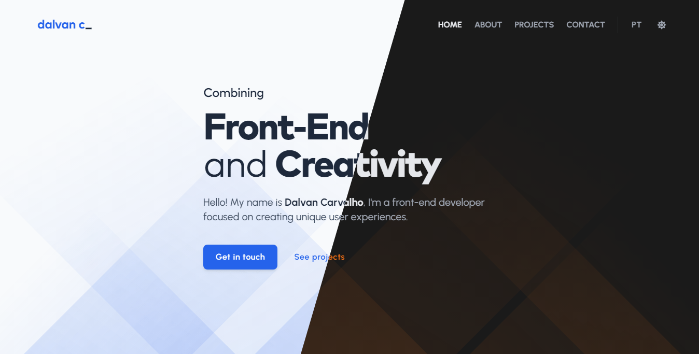
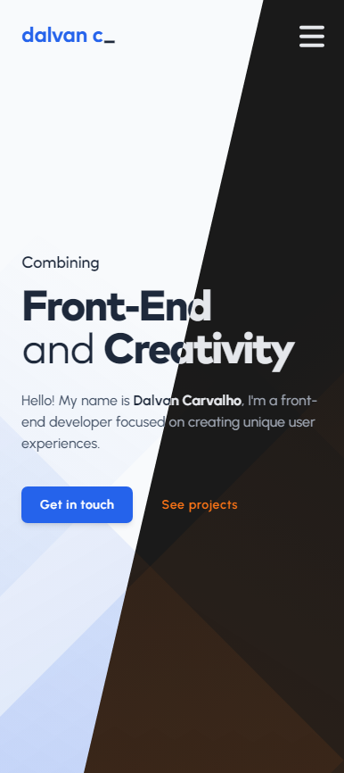

<h1 align="center">Dalvan Carvalho's personal page</h1>

<div align="center">
  
  &nbsp;
  
  &nbsp;
  
</div>

<br>

<p align="center">
  Welcome to the repository of my personal page, built with
  <a href="https://vitejs.dev/">Vite</a> and
  <a href="https://react.dev/">React</a>, and deployed with
  <a href="https://vercel.com/">Vercel</a>!
  The page is available in <strong>Brazilian Portuguese</strong> and <strong>English (US)</strong>.
</p>

<br>

<div align="center">
  
</div>

<br>

## Table of contents

- [Some quick notes](#some-quick-notes)
- [About](#about)
- [Appearance](#appearance)
  - [Desktop](#-desktop)
  - [Mobile](#-mobile)
- [Resources](#resources)
- [Installation](#installation)
- [Building and running for production](#building-and-running-for-production)
- [Style references](#style-references)
  - [Fonts](#-fonts)
  - [Colors](#-colors)
  - [Icons](#-icons)
- [License](#license)

## Some quick notes

- Even though I'm based in Brazil and speak Portuguese, I prefer to keep this ReadMe, my [GitHub profile](https://github.com/dalvancarvalho), and all coding-related content in English to reach a wider audience. If you are Brazilian (or from another country that speaks Portuguese) and have difficulty reading in English, you can find the Portuguese version of this ReadMe [here](./README-pt.md).

- You are free to fork this repository if you wish, but please don't forget to give me proper credit if you plan to use it for purposes other than studying. If possible, link it back to this URL: [https://dalvanc.com/](https://dalvanc.com/).

- The page is continually evolving, so stay tuned for future updates!

## About

This project was created to serve as my personal page/portfolio and document my journey in the world of Front-End development. It was my first time using **React**, providing a great opportunity to learn about the advantages it offers over vanilla JavaScript. All resources used in its development are listed in the [Resources](#resources) section.

## Appearance

The page counts with a light and a dark version. You can preview both in the screenshots below:

### ⬩ Desktop

<div align="center">
  
</div>

### ⬩ Mobile

<div align="center">
  
</div>

## Resources

In the table below, all the resources used in the development of the page are listed:

| Resource                                                                      | Usage                                                 |
| ----------------------------------------------------------------------------- | ----------------------------------------------------- |
| [EmailJS](https://www.emailjs.com/)                                           | E-mail sending, directly from the contact form        |
| [Font Awesome](https://fontawesome.com/)                                      | Icons and brand logos                                 |
| [GSAP](https://greensock.com/gsap/)                                           | Animations across the page                            |
| [i18next](https://react.i18next.com/)                                         | Internationalization feature                          |
| [Prism](https://prismjs.com/)                                                 | Syntax highlighting for code snippets                 |
| [React Helmet Async](https://www.npmjs.com/package/react-helmet-async/)       | Metadata manipulation                                 |
| [React Router](https://reactrouter.com/en/main/)                              | Routing management                                    |
| [React Scroll](https://www.npmjs.com/package/react-scroll/)                   | Anchor tags management across the page                |
| [React Scroll Parallax](https://www.npmjs.com/package/react-scroll-parallax/) | Parallax effect on the hero section and project cards |

## Installation

> 📌 **Before you start:** Make sure you have both **Node.js** and **Git** installed on your system. You will need them to install the project's dependencies and perform all Git-related tasks, such as committing and pushing your changes to your own repository on [GitHub](https://github.com/).
>
> [**Download Node.js**](https://nodejs.org/en/download) - _Go for the **LTS** version if you are not sure or never installed **Node.js** before_ <br> [**Download Git**](https://git-scm.com/downloads)

1. After fork this repository, navigate to its folder and open the terminal. To make things easier, you can also open the terminal directly from your code editor (I recommend [Visual Studio Code](https://code.visualstudio.com/)).

2. Install all the project's dependencies:

   ```
   npm install
   ```

3. Run the development server:

   ```
   npx vite
   ```

## Building and running for production

1. Generate a production build:

   ```
   npx vite build
   ```

2. Preview the production build (as it will appear when deployed):

   ```
   npx vite preview
   ```

## Style references

### ⬩ Fonts

| Text element |                       Font family                        |    Type    |
| ------------ | :------------------------------------------------------: | :--------: |
| Title        |         [Mark Pro](https://8font.com/mark-pro/)          | sans-serif |
| Paragraph    |  [Urbanist](https://fonts.google.com/specimen/Urbanist)  | sans-serif |
| Code snippet | [Fira Code](https://fonts.google.com/specimen/Fira+Code) | monospace  |
| Special      | [Rock Salt](https://fonts.google.com/specimen/Rock+Salt) |  cursive   |

### ⬩ Colors

| Role                      | Name in Tailwind |                              Hex code                              |
| ------------------------- | :--------------: | :----------------------------------------------------------------: |
| Accent                    |     blue-600     |  `#2563eb` |
| Accent (dark version)     |    orange-500    |  `#f97316` |
| Background                |  _custom color_  |  `#f8fafc` |
| Background (dark version) |  _custom color_  |  `#1a1a1a` |
| Text                      |    slate-600     |  `#475569` |
| Text (dark version)       |     gray-400     |  `#9ca3af` |

### ⬩ Icons

All icons used are from [Font Awesome](https://fontawesome.com/).

## License

This project is licensed under the **MIT license**. You can read the full license terms by clicking [here](./LICENSE).

&copy; 2023 **Dalvan Carvalho**
